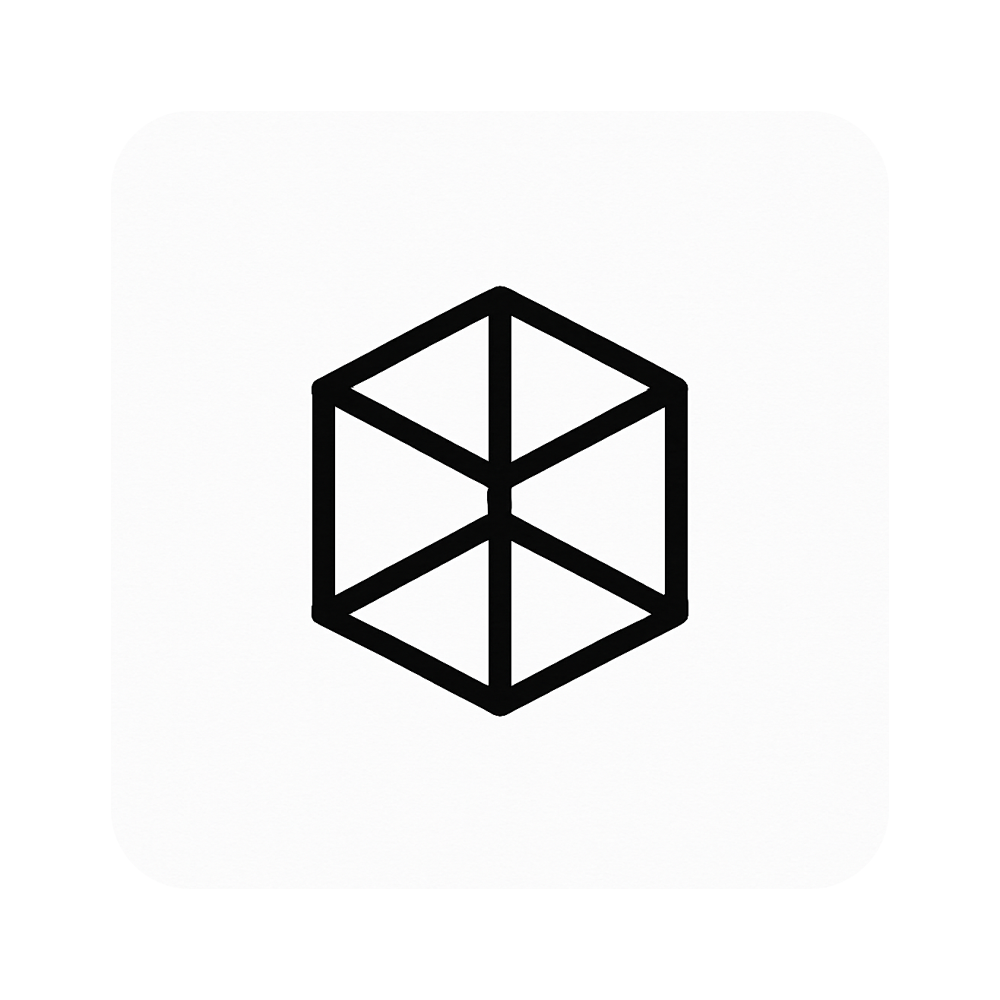
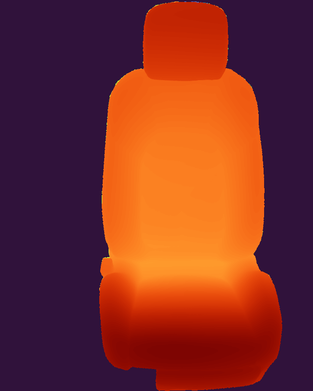
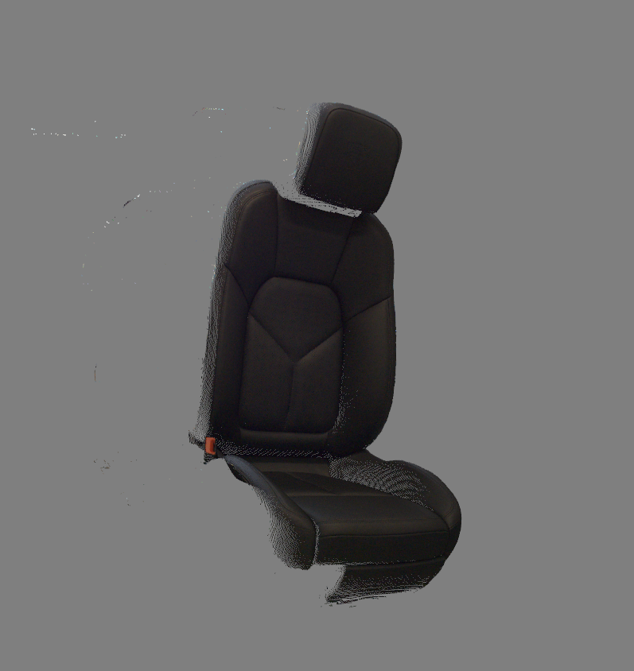

<div align='center'>

# StereoSense


<strong>Complete flow for 3D reconstruction form stereo cameras</strong>  

</div>

#### Conda installation
```bash
# clone project
git clone https://github.com/lus105/StereoSense.git
# change directory
cd StereoSense
# update conda
conda update -n base conda
# create conda environment
conda create --name StereoSense python=3.11
# activate conda environment
conda activate StereoSense
# install pytorch with gpu support. MAKE SURE, YOUR GPU IS CUDA COMPATIBLE
pip install torch==2.6.0 torchvision==0.21.0 torchaudio==2.6.0 --index-url https://download.pytorch.org/whl/cu124
# install rest of the requirements
pip install -r requirements.txt
```

#### Download resources
```bash
# navigate to root
cd StereoSense
# camera configuration files
gdown https://drive.google.com/drive/folders/1eQgWBdZ5Wql8KhbyHwOw1qTIiZa8p0fI?usp=drive_link --folder
# data
gdown https://drive.google.com/drive/folders/1NLBtNG1S1Re7wvpqb_stPmDM85cfIMTI?usp=drive_link --folder
# models
gdown https://drive.google.com/drive/folders/1iYu9bRODKAQKzr25ATOwjRbDO71O4Yhf?usp=drive_link --folder
# output (generated pointclouds)
gdown https://drive.google.com/drive/folders/1acZNnXLbF-1pbCH3Cdu4D7wpWsstc3ap?usp=drive_link --folder
```
<strong>Note:</strong> for using complete flow (main.py), install [basler pylon.](https://www.baslerweb.com/en/software/pylon/?srsltid=AfmBOooUIwLYSjNfoSDrSVLIKNl0GcDOSuO1PzaT0-Hp7pFtrDHgTb_H)

#### Instructions (use with basler cameras)
1. Gather calibration data with basler cameras: ```python src/stereo_grab_basler.py ```
2. Run stereo camera calibration: ```notebooks/1.0_Calibrate.ipynb ```. Change constants to your specific ones.
3. Download [model](https://drive.google.com/file/d/1OhkN9eJKYKqpmAayoDoskqX-ZyZSvjs-/view?usp=drive_link) and place inside models/ directory.
4. Run ```python main.py ```
5. Once the configs are loaded, press 'c' to capture frames. Results will be saved in output/ directory.

#### Instructions (use without camera)
1. Create your own camera calibration files (refer to ```notebooks/1.0_Calibrate.ipynb ```)
2. Download [model](https://drive.google.com/file/d/1OhkN9eJKYKqpmAayoDoskqX-ZyZSvjs-/view?usp=drive_link) and place inside models/ directory.
3. Grab sample images (left and right) and place inside data/samples directory.
4. Run ```notebooks/2.0_Stereo_inference.ipynb ```

#### Notes

The input size of the model is 800x640 (hxw).

#### Expected result

<div align='center'>



</div>

#### Resources

- Model used: https://github.com/NVlabs/FoundationStereo
- Point Cloud Viewer using OpenCV Viz: https://github.com/rytisss/anaglyph3D